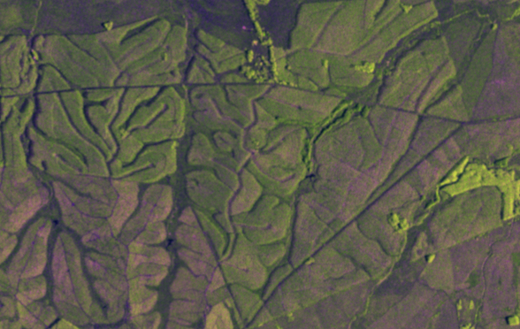
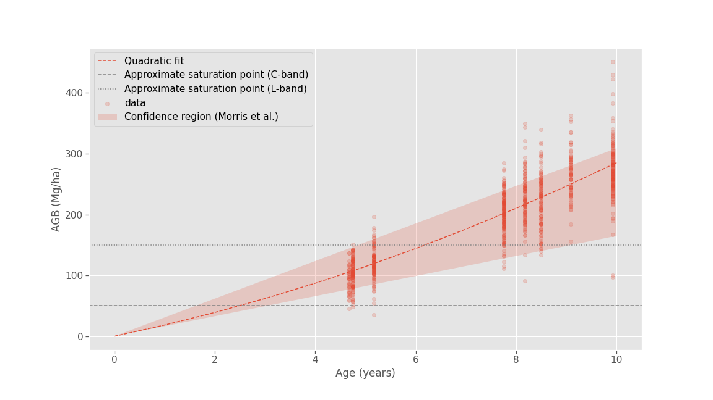

# ⚠️ Showcase-only repository ⚠️
For confidentiality reasons, all data provided by the client company is excluded from this public repository. Some parts of the code will not work. Results and methodology details are still outlined in the [report](report/report.pdf).

# Forestry Yield Prediction Using Sentinel-1 Images
|  |
|:--:|
| *The forest zone we studied as seen by the Sentinel-1 satellite* |

In this project, we assessed the possibility of predicting tree volumes from radar images. We analyzed the problem of backscatter saturation, and provided estimates of the age at which this saturation should occur (around 2.5 years for the C band, and 6.2 years for the L band). We partly confirmed this by analyzing a newly-planted forest whose age was known.

|  |
|:--:|
| *Our estimate of the saturation age for C and L-band, based on a fit to ground-truth data and estimates from the tree biology literature* |

We also provided a method, including a normalization step and a three-scale analysis, to check for a relationship between backscatter values in SAR images and measured tree volumes. We applied the method to a forest for which we had ground-truth data and confirmed that the signal was saturated and not sensitive to variations in volume.

Our conclusion is that the potential of these methods is undeniable, but that a wavelength such as Sentinel-1's is too short to be properly exploited for Above Ground Biomass estimation. Applying the same methods to a larger-wavelength signal is the most promising next step.

# Project structure
The following subfolders contain useful files related to the project:

- `data`: Geometry and measurement data, as well as aois, data extracted from Delgado-Matas et al.'s article, weather data...
- `forestry_yield_estimation`: Support code for the project.
- `notebooks`: Jupyter notebooks used to conduct exploration and produce figures for the report.
- `report`: All the files used to produce the reports, including all the figures in png format.

# How to use the code to reproduce results
1. Install the requirements.txt file (`pip install -r requirements.txt`).
2. Fill in your credentials for AWS and Copernicus in the `env_vars.json` file.
3. Run the `main.py` file to download the images, define aois for the north and south zones, etc. For convenience, everything except the images is already provided in this repo, but `main.py` can serve as a useful reference on how to reproduce these files.
4. Navigate to the notebooks folder and start interacting.

If you would like to reproduce a specific result as shown in a figure of the report, please note that the report contains a "Code" section specifying the name of the notebook used to produce each figure.

# Report details
The report was produced in markdown and compiled to Latex and pdf using `pandoc`. See the scripts `compile_presentation.sh` and `compile_report.sh` in the report folder for the specific commands used.

