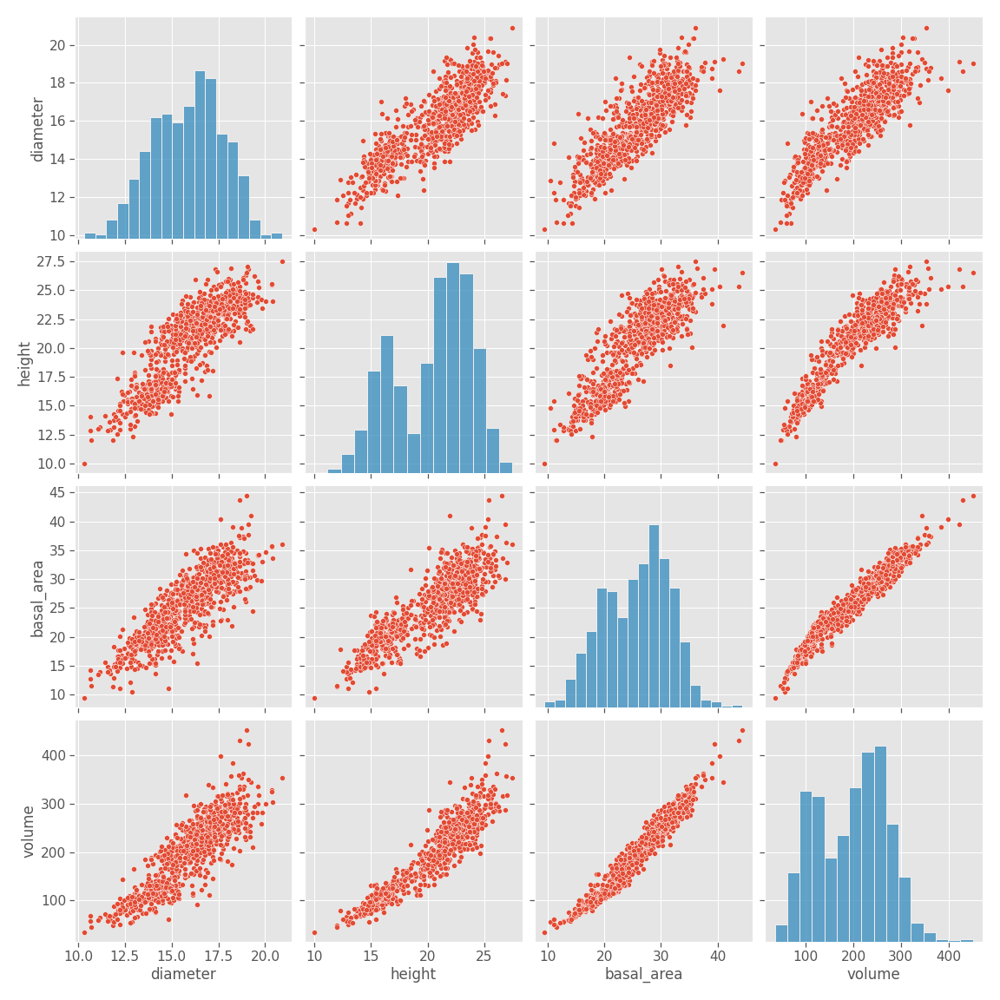
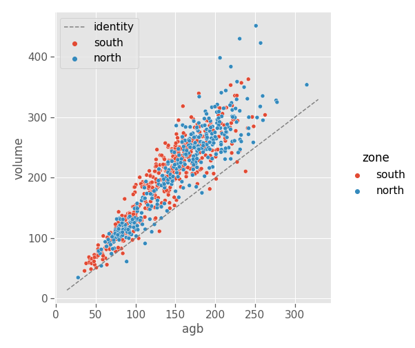
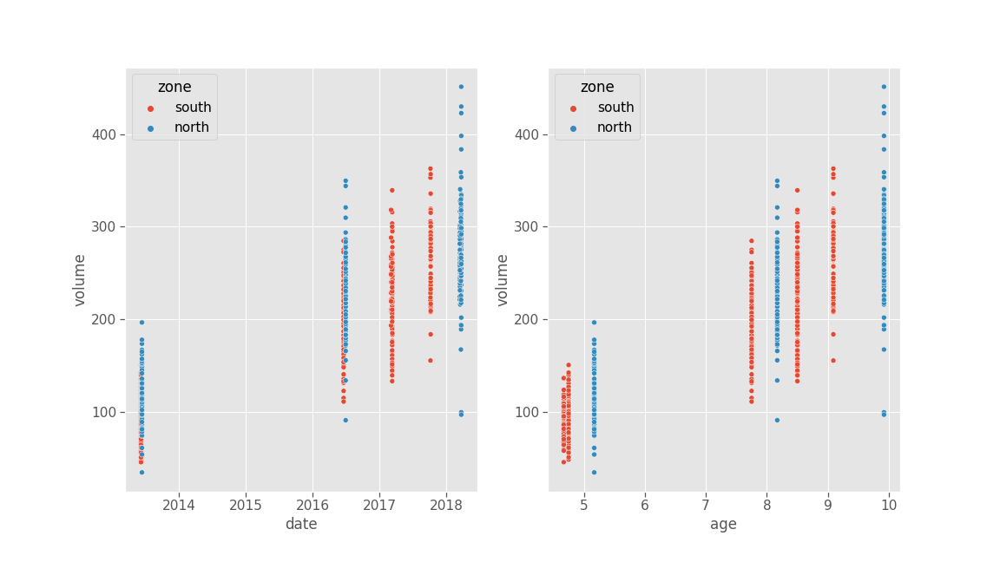
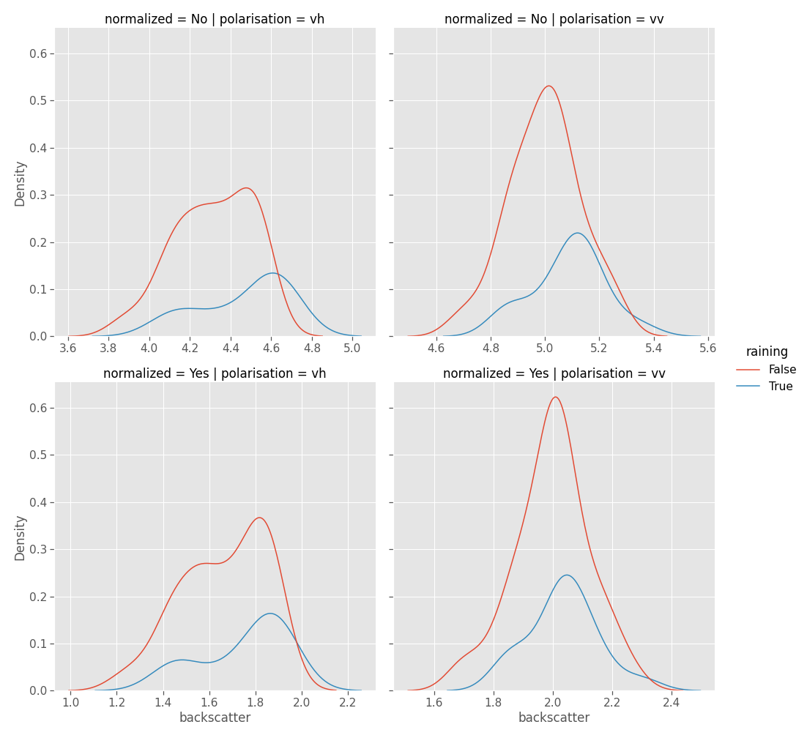
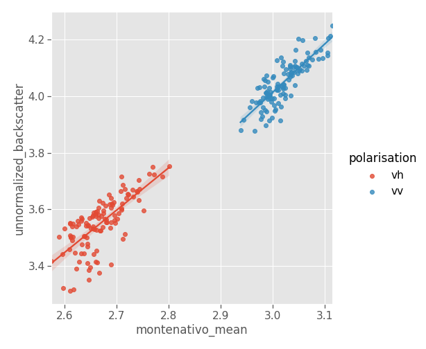
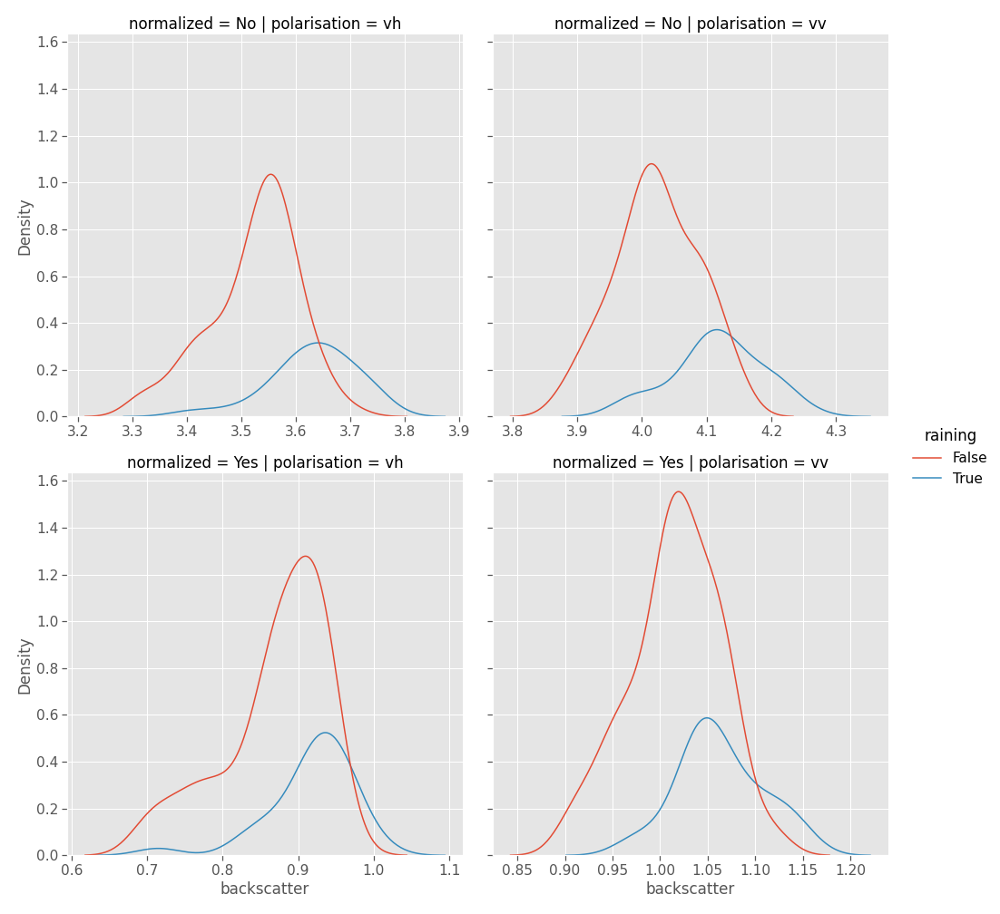
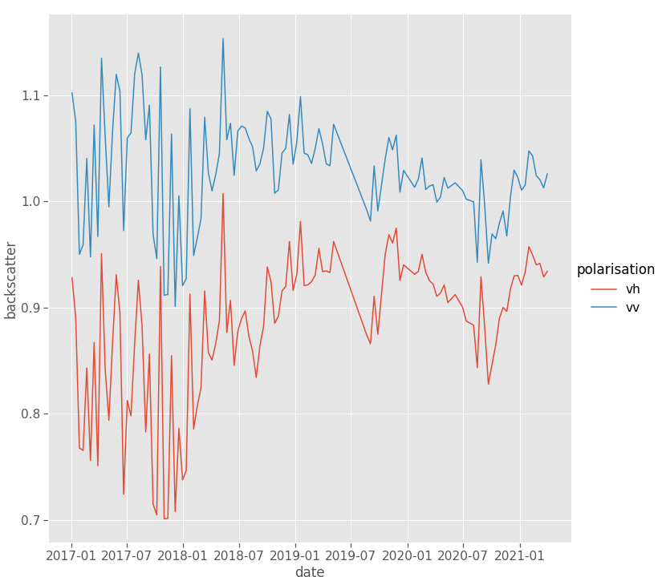
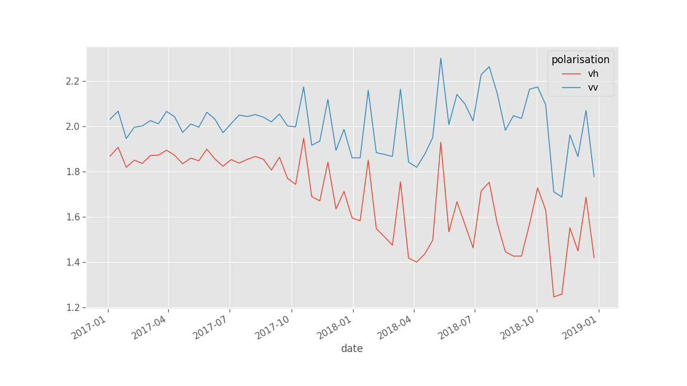
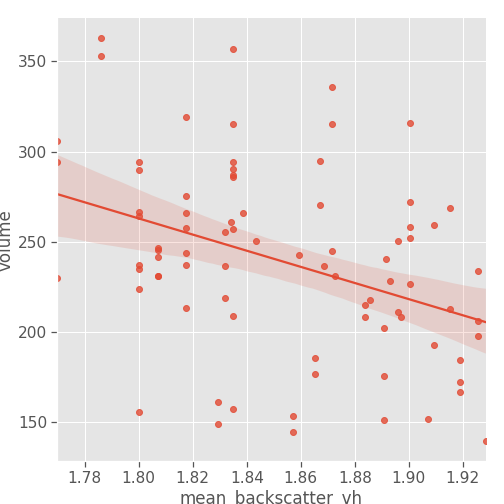
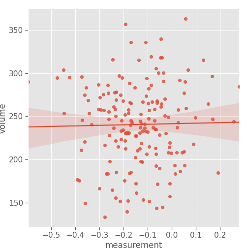

## Introduction

{width=90%}

## Related work
Main insights:

- There is definitely exploitable information in Sentinel-1 images
- The problem of saturation is serious and particularly affects S1

Goals:

- Verify that there is no exploitable information about the AGB of an already mature forest ;
- In doing so, establish methods which could be applied to larger wavelengths ;
- Identify and correct for sources of variation in the radar measurements ;
- Confirm that Sentinel-1 images contain useful information for young forests and try to estimate the saturation point in years.

# Data
## Summary
Data:

- Measurements (ground truth)
- Images
- Polygons
- Weather

Zones:

- North
- South
- New Forest
- Montenativo

## Measurements: Exploration
Two zones:

- North
- South

Main fields:

- Date
- Coordinates
- Rodal (segment of forest)
- Height
- Diameter
- Basal area
- Volume

## Measurements: Exploration
{width=70%}

## Measurements: Exploration
{width=50%}

## Measurements: Units
{width=50%}

## Measurements: Choosing a zone
| year   | north   | south   |
|:-------|--------:|--------:|
| 2013   | 103     | 151     |
| 2016   | 103     | 147     |
| 2017   | 0       | 176     |
| 2018   | 144     | 0       |
| Total  | 350     | 474     |

Table: Number of measurements for each year in the north and south zone

## Measurements: Choosing a zone
{width=70%}

## Images
| zone        |   n_images | resolution   | first_date   | end_date   |
|:------------|-----------:|:-------------|:-------------|:-----------|
| south       |         61 | 588x372      | 2017-01-04   | 2018-12-25 |
| new_forest  |        116 | 480x288      | 2017-01-04   | 2021-04-01 |
| montenativo |        116 | 972x348      | 2017-01-04   | 2021-04-01 |

## Images and Polygons: South
{width=80%}

## Images and Polygons: South
{width=80%}

## Images and Polygons: New forest
{width=80%}

## Images and Polygons: New forest
{width=80%}

## Images and Polygons: Montenativo
{width=80%}

## Images and Polygons: Montenativo
{width=80%}

## Weather
{width=40%}

# Methods and Results
## Normalisation: South
{width=55%}

## Normalisation: South
{width=55%}

## Normalisation: New forest
{width=55%}

## Normalisation: New forest
{width=55%}

## New Forest backscatter
{width=55%}

## New Forest backscatter
{width=90%}

## AGB prediction on the South Zone
Three scales:

- Whole zone
- Rodal (forest segment)
- Tree

## Theoretical saturation threshold
{width=50%}

## Zone scale
{width=90%}

## Zone scale
{width=90%}

## Rodal scale
{width=70%}

## Rodal scale
{width=60%}

## Rodal scale
{width=50%}

## Rodal scale
{width=50%}

## Single-tree scale
{width=50%}

## Conclusion
- We established a method (normalization, 3-scale analysis) for assessing the relationship between backscatter intensities and volume
- The C-band is indeed saturated for our forest
- The saturation point could be around 3 years of age for our species
- Reference-area normalization helps reduce variation a lot but is terrain-specific

## Future work
- **Use a larger wavelength**
- Use a more adaptive normalization method that does not leave residual weather effects in young forest
- Make a more precise estimate of the saturation point for our case (using more ground truth data)
