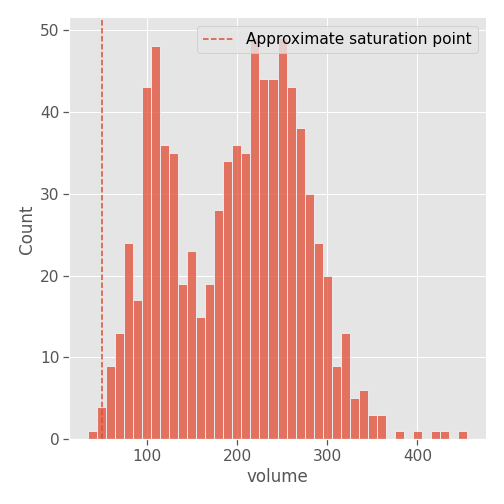

# Introduction
Forestry companies operate on fairly long time scales: The time from planting to cutting down trees is around 10 years. During this long period, their priority is to reduce costs. Despite this, companies still need to assess the health and yield of their forests: This requires measurements of the volume of trees at several times during the lifetime of the forest.

Forestry companies therefore face a cost-accuracy tradeoff, where a more accurate yield estimate requires more measurements, which comes at a higher cost. Using freely available satellite images to get a complementary estimate seems a reasonable approach to overcome this tradeoff. The aim of this project was to determine whether this was possible in practice.

While we will show that there is definitely information to be gained from SAR images on the volume of biomass in a forest, the major problem of backscatter saturation means that the signal becomes difficult to exploit once a certain key volume is attained.

Our goal will be to use the data at our disposal to characterize this saturation threshold, and to assess the possibility of overcoming it using larger wavelengths such as L-band sensors.

# Related Work and Objective
The goal that we are trying to achieve is to assess the possibility of estimating the volume of trees in a patch of forest using radar images obtained from Sentinel-1.

The problem of estimating Above Ground Biomass (AGB) from radar satellite images, specifically Sentinel-1 images, has been studied before, for instance in [@assessment;@generic_method] and more recently in [@forest_biomass_estimation].

These studies show that there is definitely relevant information for AGB estimation in Sentinel-1 images, but all sources point to the main limiting factor being the problem of backscatter saturation (e.g. [@forest_biomass_estimation]): As the volume of biomass increases, if the signal's wavelength is too small, it starts to be fully reflected by the branches and leaves of trees and never reaches the ground, making it incapable of detecting further growth. Indicators utilizing several different wavelengths seem to be able to overcome this problem [@narrow_band].

The C band, used by Sentinel-1, is often cited as being strongly affected by saturation. Indeed, in [Estimating the saturation age], we estimate the saturation age of the C band to be around 2.5 years (compared to 6.2 years for the L band).

With this knowledge in mind, we did not expect that C-band data would allow us to estimate AGB on our data, which is of a fairly mature forest (more than 8 years old for the earliest images). Nevertheless, we wish to verify that there is indeed no exploitable information present in the data for this forest, and to design methods which could be applied to larger wavelengths (such as L-band).

The objectives of this project are the following:

- Assess and correct sources of variation in the measurements to reduce noise and facilitate analysis ([Normalisation method]);
- Provide an estimate of the forest age at which the signal should start to saturate ([Estimating the saturation threshold]);
- By studying a newly-planted forest, check the validity of the estimated saturation age ([New forest study: Confirming the C-band saturation age]);
- Establish a thorough method for assessing the relationship between radar backscatter and AGB, and use it to verify that there is no such relationship in the case of an already mature (More than 8 year-old) forest when using the C band ([AGB prediction : A three-scale analysis]).

# Data
## Geography
The region studied during this project is land owned by a forestry company operating in western Uruguay, in the Paysandú department. It is separated into two zones, called Paysandu Norte and Pandule. Since the first is situated north of the second, we named the zones "north" and "south", respectively.

Each zone is further separated into small subdivisions called "rodals" (302 in total). We had access to polygons defining those subdivisions in geographical coordinates.

Two other important zones should be noted:

- **Montenativo:** Northeast of the two forest zones is an area of native forest, protected against cutting by Uruguayan law. Since this area stays mostly unchanged, we used it to normalize backscatter values.
- **New Forest:** Just south of the south zone is a patch of forest which was visibly cut in 2017. We used it to offer some confirmation of our predicted C-band saturation age.

## Measurements
The database we used records measurements taken on trees in two zones of a forest, on 15 unique dates.

The fields in this database include, among others:

- The date of measurement (ranging from 2013 to 2018)
- The geographical coordinates of the tree
- The height, diameter at breast height, basal area (area at breast height) and volume of the tree

### Relationships between measurements
The quantity that we wish to predict is the volume of the trees. Let us visualize this quantity and check that it follows certain basic assumptions. First, in a given rodal, it is expected that the measurements go up year by year. Figure \ref{volume_by_rodal} shows volume measurements over time for 12 rodals.

As the plot shows, there is a lot of variation between measurements even in the same rodal and date. We can still see a clear visible trend.

A quick sanity check shows that only 3 of the 302 rodals see their average volume go down from one year to the next, and those are rodals with no more than one measurement a year. The data is coherent with the fact that the trees are growing.

Some aspects of the measurements, such as the relationships between the diameter, basal area, height and volume measurements as well as their units is not entirely clear.

<!-- |            |   diameter |   height |   basal_area |   volume |
|:-----------|-----------:|---------:|-------------:|---------:|
| diameter   |       1    |     0.73 |         0.71 |     0.75 |
| height     |       0.73 |     1    |         0.75 |     0.87 |
| basal_area |       0.71 |     0.75 |         1    |     0.95 |
| volume     |       0.75 |     0.87 |         0.95 |     1    |

Table: Pairwise $R^2$ statistics between measurements -->

As Figure \ref{pairplot} shows, the relationships between these four quantities are noisier than one would expect. 

For instance, basal area is normally calculated by using the diameter at breast height and applying the formula for the area of a circle, so the relationship should be entirely deterministic. Instead, around 30% of the variance of the basal area measurement is unaccounted for by this relationship. The source of this noise remains unclear.

### Units
Another question is the unit these quantities are expressed in. Given its range of values, it's very likely that the diameter is expressed in centimeters. We estimate the basal area from that (by applying the formula for the area of a circle). Then, we use the fact that the spacing of the trees is 3.5 m x 2.14 m, which means there are about 1335.1134846461948 trees per hectare, and express the basal area in m²/hectare (a common unit for expressing this quantity).

{width=50%}

Figure \ref{basal_area} shows a close correspondence of this estimate and the data, suggesting that this is indeed the unit used for the basal area in our data.

We did not have access to the formula used to calculate the volume. A simple model is to multiply the basal area by the height (modeling the tree as a cylinder) and multiply by some constant which accounts for the fact that the tree tapers off. We used a simple constant of one half, reasonable for Eucalyptus species ([See Eq. 6 of @eucalyptus_growth]).

Then, knowing the species of trees present in this forest (Eucalyptus Dunnii), we can get its approximate density from the literature. We refer to [@e_dunnii_growth] and use a value of 500 kg/m³. Using this quantity, we compute an estimate of the Above Ground Biomass (AGB), expressed in Megagrams per hectare (Mg/ha), which is the most standard unit for it in the literature.

{width=50%}

Figure \ref{agb} shows a good correspondence between our estimate and the data. 

To summarize, we concluded that the units of the measurements are the following:

- Diameter: cm
- Height: m
- Basal area: m²/ha
- Volume (AGB): Mg/ha

### Choosing a zone to work on
To simplify our analysis, we decided to select one of the two zones (north and south) to focus on.

Figure \ref{zone_comparison} and Table \ref{table_zone_comparison} below show the distribution of volume measurements depending on date and age for the two zones.

| year   | north   | south   |
|:-------|--------:|--------:|
| 2013   | 103     | 151     |
| 2016   | 103     | 147     |
| 2017   | 0       | 176     |
| 2018   | 144     | 0       |
| Total  | 350     | 474     |

Table: Number of measurements for each year in the north and south zone\label{table_zone_comparison}

Figure \ref{zone_comparison} shows that the two zones span approximately the same dates, with the south zone trees having overall younger ages at the time of measurements (due to the south zone being planted after the north zone). The north zone seems to have more noisy measurements with a higher number of outliers. Table \ref{table_zone_comparison} also shows that it has 35% less samples than the south zone.

For these reasons, **we have conducted all our experiments on the south zone only.**

## Images
To conduct our experiments, we used images from the Sentinel-1 radar satellite constellation. All images were taken from the Sentinel-1B satellite, relative orbit 170, GRD product. Therefore, what we refer to as "images" in this report are actually crops of bigger images, and two of those crops taken on the same date come from the same radar image.

| zone        |   n_images | resolution   | first_date   | end_date   |
|:------------|-----------:|:-------------|:-------------|:-----------|
| south       |         61 | 588x372x2    | 2017-01-04   | 2018-12-25 |
| new_forest  |        116 | 480x288x2    | 2017-01-04   | 2021-04-01 |
| montenativo |        116 | 972x348x2    | 2017-01-04   | 2021-04-01 |

Table: Image statistics for each zone\label{table_image_statistics}

Table \ref{table_image_statistics} shows statistics for images taken for the three zones. Each image has two channels corresponding to the VV and VH polarisation.

All our images are taken after 2017-01-04, as this is the first available date for Sentinel-1B images.

In the south zone, we only downloaded 61 images, up to the end of 2018, since that is when all the trees in the zone have been cut and our measurement data ends.

<!-- \begin{figure}%
    \centering
    \subfloat[\centering South]{{\includegraphics[width=\textwidth]{img/images/south.png}}}%
    \subfloat[\centering New forest]{{\includegraphics[width=\textwidth]{img/images/new_forest.png}}}%
    \subfloat[\centering Montenativo]{{\includegraphics[width=\textwidth]{img/images/montenativo.png}}}%
    \caption{Images taken from the three zones (VV polarisation)}
\end{figure} -->

Figures \ref{south_image}, \ref{new_forest_image} and \ref{montenativo_image} show examples of images taken in the three zones.

## Polygons
In addition to the images, we had access to polygons provided by the forestry company. These define the boundaries of the rodals (see [Geography]) of the two zones. Figure \ref{south_polygons} shows these polygons superimposed on a mean-image of the south zone.

We also hand-defined the boundaries of the other two zones of interest: New forest and Montenativo. Figures \ref{new_forest_polygons} and \ref{montenativo_polygons} show mean-images of these two zones with their corresponding polygon.

## Weather
Finally, we were curious about the potential influence of rainfall on the measurements. Since we want to use backscatter intensities as an indicator, we need to be mindful of factors such as rainfall which might influence the dielectric properties of the scene and thus the backscatter independently of what we want to measure.

Therefore, we used web scraping to get rainfall amounts for every 3-hour segment of every date where we had images (131 dates) from www.worldweatheronline.com.

Then, for every date, since all our images were taken at 9:05 am, we extracted the rainfall from 12:00 am to 9:00 am that day and averaged it to get a rough estimate of how wet the ground must be.

This data was useful to check that our normalization method was effective at getting rid of effects such as those caused by the weather on backscatter.

# Methods and Results
## Normalisation method
Since our experiments relied on comparing backscattering values across time, we wished to find a way to subtract from the measured backscatter any fixed effects which might affect the whole image, due for instance to the weather.

As was mentioned previously, our normalization scheme used the Montenativo zone as a reference area, owing to our prior knowledge that this area of native forest is protected by Uruguayan law against any type of exploitation and should therefore remain fairly similar over time. For each date and polarisation, the mean of the backscatter (in log space) was recorded and matched with the corresponding means in the South zone. The normalization is then simply a subtraction (which in the linear domain corresponds to taking a ratio image).

{width=55%}

Figure \ref{south_correlation} shows the fairly strong relationship between the mean of the Montenativo polygon and that of the south zone polygons. The proportion of the variance of the measurements which is removed by subtracting the Montenativo mean is 20%, for both polarisations.

{width=55%}

The weather data which we obtained earlier gives us a way to check the effectiveness of our normalization method: In Figure \ref{south_rain_effect}, we see that before normalization, the distribution of backscatter means when the weather is rainy is significantly shifted to the right compared to when it is dry. After normalization, a large part of this effect disappears, confirming that our normalization helped make these values more comparable.

Interestingly, results are different in the New forest zone.

{width=55%}

As Figure \ref{new_forest_correlation} shows, the relationship between the Montenativo mean and the New forest polygon mean is much stronger than in the South zone. The proportion of variance removed by normalizing is 47% for VH and 57% for VV, again much higher than the South zone.

{width=55%}

However, it seems that the effect of weather is only partly reduced, with a still significant residual bias in backscatter on rainy days as shown in Figure \ref{new_forest_rain_effect}. Our theory is that the South zone being an older forest makes it more similar to the Montenativo forest, in particular in the way its backscatter responds to weather, making our normalization more effective.

A more refined, adaptive normalization method would be required to properly normalize our values, but as we will see in the next section, this simple method already seems to improve the quality of our results substantially.

## Estimating the saturation threshold
### Comparison with data
Before trying to see whether we can extract any information about the growth of trees in our forest from Sentinel-1 images, we can get a rough idea of what is possible using thresholds from the literature.

Figure 3 in [@assessment], in particular, seems to show that saturation for Sentinel-1 happens around an AGB of 50 Mg/ha. Figure \ref{saturation} compares this threshold to the volume distribution in our database, which we determined was expressed in Mg/ha (see [Units]).

{width=50%}

Around 0.5% of the measurements fall under the threshold reported in [@assessment], which means there is little chance of observing any relationship between the images and our measurements. Nevertheless, we will thoroughly check that this is the case, applying a methodology which can be used as-is for larger wavelengths less susceptible to this saturation effect.

### Estimating the saturation age
One metric which would be of interest is to estimate at what age the trees have grown enough that the signal saturates. This would give us a more concrete view of what to expect from our C-band analysis and its potential application to a larger wavelength (e.g. L band).

Our first attempt at doing this was using data from an article by Delgado-Matas et al [@eucalyptus_growth].
We used the data they recorded for the volume of six species of Eucalyptus throughout their life (up to 40 years old) and kept the lower and upper bound of all the studied species, to get a range of plausible values.

The unit of volume in Delgado-Matas et al.'s article is m³/ha, which we converted to Mg/ha (assuming a density of 500 kg/m³, see [Units]). The plots they studied contain 1111 trees/ha (as opposed to 1335 in our case), so we added a factor to correct for this.

![Lower and upper bounds of Eucalyptus volumes according to [@eucalyptus_growth]\label{saturation_age_delgado}](img/eda/saturation_age_delgado.png)

Figure \ref{saturation_age_delgado} shows the bounds we found using this method. Sadly, they do not fit our data at all. This could be due to differences between Angola (where the study was conducted) and Uruguay, or to the difference in species, or to problems in our conversion to AGB. Whatever the cause, we cannot use these bounds for our data. We wished to show this attempt to highlight the potential value of this study, and to show the type of growth curve that can be expected for Eucalyptus species, as shown in Figure \ref{growth_curves}.

![Slowest and fastest growth curves in Delgado-Matas et al.'s study [@eucalyptus_growth]\label{growth_curves}](img/eda/growth_curves.png)

As Figure \ref{growth_curves} shows, the growth curve is not a straight line, but has a convex shape during the first 6 to 7 years, before starting to resemble a linear function.

Following this failed attempt, we used data from another article, by Morris et al. [@morris2008]. It is less precise and only lets us use a simplified linear growth model, but is a much better fit to the data.

We used a graph digitizer to extract a lower and upper bound (based on the confidence bars given in the figure) for the mean annual increment (MAI) of Eucalyptus Dunni. The lower bound was 16.5 $\text{t ha}^{-1} \text{y}^{-1}$ and the upper bound 30.9 $\text{t ha}^{-1} \text{y}^{-1}$.

![Lower and upper bounds of Eucalyptus volumes according to [@eucalyptus_growth], and fit to the data\label{saturation_age}](img/eda/saturation_age.png)

We represented the corresponding confidence region for AGBs on Figure \ref{saturation_age}, along with the measurement data. The measurements fall roughly within our lower and upper bounds, lending credit to this simple linear growth model. By looking at where those lines cross the 50 Mg/ha threshold, we can infer that the age of saturation lies between 1.6 and 3.0 years for the C band.

It is interesting to note that the same analysis yields bounds of 4.9 to 9.1 years of age for the L band, which has a saturation point situated around 150 Mg/ha (according to [@assessment]), giving good hope for an application to the L band of the methods outlined in this report.

Since growth curves tend to be slightly convex as we saw with Delgado-Matas et al.'s growth curves, we added a quadratic fit to the data with 0 intercept to provide some "best estimate". The fact that it stays between our bounds is reassuring.

| Band   |   Lower Bound |   Upper Bound |   Quadratic fit |
|:-------|--------------:|--------------:|----------------:|
| C      |           1.6 |           3   |             2.5 |
| L      |           4.9 |           9.1 |             6.2 |

Table: Estimates for the saturation age of the trees in our forest (years)\label{table_saturation_age}

Table \ref{table_saturation_age} summarizes the various estimates of saturation ages. Note that the two bounds are pessimistic estimates, since growth is usually slower during the first years. The quadratic model should be more reliable, since it bears closer resemblance to a typical growth curve for Eucalyptus. **The key takeaway is that we estimate the age of saturation to be around 2.5 years for the C band, and 6.2 years for the L band.**

From these results, we can expect the following from Sentinel-1 images:

- Images of the South zone, which are all above 8 years old, should be completely saturated and the signal should be the same independently of volume.
- Images of the New forest zone should show some signal, but saturate around 2 to 3 years of age.

## New forest study: Confirming the C-band saturation age
Before we present our study of the zone for which we have ground truth measurements, let us look at the results obtained for the New forest zone. For each date and polarisation, the mean of the whole polygon (see [Polygons]) of the New forest zone was extracted, normalized using the method presented above, and plotted as a function of time (Figure \ref{timeseries}).

{width=55%}

Several interesting observations can be made about this graph. First, we see very high variability in the backscatter values when the trees are very young, and a relative stabilisation as they grow taller. This effect will also be highlighted later in this report for the South zone.

Secondly, VH and VV backscatter seem to be extremely correlated, even in areas of high variability.

Figure \ref{timeseries_ratio} shows what happens when we take the difference between VH and VV backscatter (in log space, i.e. a ratio in linear space) instead of plotting them separately.

{width=90%}

Our main observations are the following:

- The difference in variability between different times has been completely eliminated by this operation, and we now have a smooth signal.
- We see a clear upward trend, which seems to plateau around the beginning of 2020 (when the trees are 3 years old). This may correspond to saturation, and the age at which it happens is roughly in accordance with the predictions made in the section [Estimating the saturation age].
- Finally, comparing the blue curve (without a normalization step) to the red curve confirms that the normalization step helps reduce noise while keeping the trend intact.

The idea for using the VH / VV ratio for detecting biomass stems in part from the definition of the Radar Vegetation Index (RVI) in chapter 5 of the SAR Handbook [@sar_handbook]. This index is the ratio of the HV backscatter to a weighted sum of the other three polarisations (HH, VH and VV), and "is a measure of the randomness of scattering". Since we do not have access to all four polarisations, the closest index we can create is a ratio of VH over VV. This is justified by the fact that VH is more sensitive to random scattering by leaves and branches than by that of smooth surfaces.

## AGB prediction : A three-scale analysis
In order to thoroughly investigate any possible information that might be present in the images, we studied the data on three scales :

- On the whole zone scale, we checked if the aggregate values show any upward trend as the trees grow.
- On the rodal (forest segment) scale, we checked if aggregate values for each rodal show any relationship with the volume of the trees within it.
- On the single-tree scale, we checked if backscatter values near the geographical location of a tree showed any relationship with its volume.

It is important to note that this three-scale method generalizes to any band of a larger frequency than Sentinel-1, e.g. the L band.

### Zone scale
Much like our analysis of the New forest zone, we started by plotting the VV and VH backscatter aggregates for the whole zone as well as their ratio to see if we witnessed any trend.

In Figure \ref{zone_scale_timeseries}, we see the reverse pattern to what we observed in the New forest case: variability grows with time, as trees get cut. Again VV and VH are very correlated and their difference, shown in Figure \ref{zone_scale_timeseries_ratio}, shows a much clearer, downwards, trend. The slight bump upwards at the end of the timeseries is unexplained.

### Rodal scale
The next step in our three-scale analysis is to use the meaningful geographical units given to us by the forestry company in the form of the so-called "rodals".

First, looking at the timeseries of both VV and VH backscatter and their ratio on a per-rodal basis (Figures \ref{rodal_scale_timeseries} and \ref{rodal_scale_timeseries_ratio}), we see much more clearly the phenomenon of high variability in both VV and VH when the trees have been cut. Since all trees in the same rodal are cut at the same time, these change points are very clear in the above plot. This phenomenon seems to be very consistent and could be used along with time series change-point detection methods to detect deforestation.

Looking at the VH/VV ratio again (Figure \ref{rodal_scale_timeseries_ratio}) yields a clearer, less noisy picture, with a clear downwards jump at the time of cutting, but no detectable trend before the trees are cut, suggesting once again that the signal is fully saturated.

Since it seems difficult to assess the variation in volume across time for a single rodal, we set out to see if it was possible to compare rodals against one another: is there a relationship between the average volume of trees in a rodal and the backscatter observed for this rodal?

For each rodal and measurement date, we extracted all the images that come before this date, and from all these images, the pixels corresponding to the rodal polygon. These pixel values were aggregated using a mean in log space, and this aggregate was compared with the actual volume from the measurements.

{width=50%}

{width=50%}

The results, shown in Figures \ref{rodal_scale_lr_vh} and \ref{rodal_scale_lr_ratio}, seem to indicate that no relationship exists between backscatter values and volume on the rodal scale.

### Single-tree scale
To conclude our study, we extracted data pertaining to specific trees and tried to match the intensity of the corresponding pixels to their measured volume.

{width=50%}

For each measurement in the database, we extracted a spatio-temporal window around the measurement and aggregated backscatter values within that window. For Figure \ref{tree_scale}, the time-window was 3 months and the space window was a 3x3 square centered on the pixel containing the tree, but many other methods were tried with similar results, most notably:

- Space window sizes of 1x1, 2x2, 3x3, 4x4 and 5x5;
- Time window sizes of 1, 3 months; time windows including all previous dates.

The conclusion is that there is no relationship to be found at this volume, due to the saturation we expect of the C band.

# Code
All code used for this project is available as a set of Jupyter Notebook files in the project repository. Table \ref{table_figure_sources} shows the source of each figure in this report.

| Figure                             | Source                        |
|:-----------------------------------|:------------------------------|
| \ref{volume_by_rodal}              | Raw data exploration.ipynb    |
| \ref{pairplot}                     | Raw data exploration.ipynb    |
| \ref{basal_area}                   | Units.ipynb                   |
| \ref{agb}                          | Units.ipynb                   |
| \ref{zone_comparison}              | Raw data exploration.ipynb    |
| \ref{south_image}                  | Zones - South.ipynb           |
| \ref{new_forest_image}             | Zones - New Forest.ipynb      |
| \ref{montenativo_image}            | Zones - Montenativo.ipynb     |
| \ref{south_polygons}               | Zones - South.ipynb           |
| \ref{new_forest_polygons}          | Zones - New Forest.ipynb      |
| \ref{montenativo_polygons}         | Zones - Montenativo.ipynb     |
| \ref{south_correlation}            | Scales - Rodal and Zone.ipynb |
| \ref{south_rain_effect}            | Scales - Rodal and Zone.ipynb |
| \ref{new_forest_correlation}       | Zones - New Forest.ipynb      |
| \ref{new_forest_rain_effect}       | Zones - New Forest.ipynb      |
| \ref{saturation}                   | Units.ipynb                   |
| \ref{saturation_age_delgado}       | Units.ipynb                   |
| \ref{growth_curves}                | Units.ipynb                   |
| \ref{saturation_age}               | Units.ipynb                   |
| \ref{timeseries}                   | Zones - New Forest.ipynb      |
| \ref{timeseries_ratio}             | Zones - New Forest.ipynb      |
| \ref{zone_scale_timeseries}        | Scales - Rodal and Zone.ipynb |
| \ref{zone_scale_timeseries_ratio}  | Scales - Rodal and Zone.ipynb |
| \ref{rodal_scale_timeseries}       | Scales - Rodal and Zone.ipynb |
| \ref{rodal_scale_timeseries_ratio} | Scales - Rodal and Zone.ipynb |
| \ref{rodal_scale_lr_vh}            | Scales - Rodal and Zone.ipynb |
| \ref{rodal_scale_lr_ratio}         | Scales - Rodal and Zone.ipynb |
| \ref{tree_scale}                   | Scales - Tree.ipynb           |

Table: Names of the notebooks used to produce each figure in this report.\label{table_figure_sources}

# Future work
Directions for future work are numerous, but one is the obvious next step: extending this study to L-band images, or even larger wavelengths. The results in this report and the literature support the idea that it is possible to infer information about AGB, if it is below the saturation threshold. Our estimates of this threshold in terms of age seem to indicate that the L band signal would saturate around 6 years of age.

Many other improvements could be made to our method:

- Although we saw that we got from the newly-planted forest showed the trend we expected, this is not solid proof that it contains the information we need. To properly verify that volume can be predicted from images, we would need ground-truth volume data for younger forests.
- In our analysis, we assumed that the area was perfectly flat, but correcting for the slope of the terrain would be an important step in ensuring the reliability of our measurements.
- Our normalization method was shown to be more effective for terrain similar to the reference area, and left residual fixed weather effects in the images of the younger forest. A more intelligent or adaptive normalization method that does not suffer from this problem could yield further progress in the readability of the signal.

# Conclusion
In this report, we assessed the possibility of predicting tree volumes from radar images. We analyzed the problem of backscatter saturation, and provided estimates of the age at which this saturation should occur (around 2.5 years for the C band, and 6.2 years for the L band). We partly confirmed this by analyzing a newly-planted forest whose age was known.

We also provided a method, including a normalization step and a three-scale analysis, to check for a relationship between backscatter values in SAR images and measured tree volumes. We applied the method to a forest for which we had ground-truth data and confirmed that the signal was saturated and not sensitive to variations in volume.

Our conclusion is that the potential of these methods is undeniable, but that a wavelength such as Sentinel-1's is too short to be properly exploited for Above Ground Biomass estimation. Applying the same methods to a larger-wavelength signal is the most promising next step.

\newpage
# References